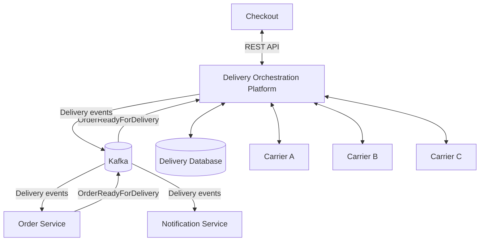

# Платформа оркестрации доставки маркетплейса

> Учебный System Design проект для портфолио системного аналитика.

**Статус:** архитектурное проектирование.

Проект посвящён проектированию платформы, которая объединяет несколько служб доставки и предоставляет внутренним системам маркетплейса единый интерфейс для расчёта, оформления и отслеживания доставки.

Результат проекта — комплект аналитической и архитектурной документации. Программная реализация не входит в текущий объём.

## 1. Бизнес-проблема

Маркетплейс работает с несколькими внешними перевозчиками, каждый из которых имеет собственные API, тарифы, ограничения и модель статусов.

Прямая интеграция каждой внутренней системы с перевозчиками приводит к дублированию интеграционной логики, усложняет подключение новых партнёров и увеличивает зависимость от особенностей внешних API.

Для решения этой проблемы проектируется Delivery Orchestration Platform.

Платформа предоставляет единый интерфейс для работы с доставкой и скрывает особенности интеграций с конкретными перевозчиками.

## 2. Основные возможности

В рамках проекта спроектированы:

- расчёт доступных вариантов доставки для каждого Shipment;
- расчёт стоимости и ожидаемых сроков;
- выбор курьерской доставки или ПВЗ;
- повторная проверка условий перед оплатой;
- асинхронное создание доставки;
- управление попытками оформления доставки у перевозчиков;
- переключение между перевозчиками;
- нормализация статусов доставки;
- отмена и возврат доставки;
- обработка сбоев внешних систем.

## 3. Границы системы

Delivery Orchestration Platform отвечает за расчёт предложений, оформление и сопровождение доставки.

Управление заказами, оплата, резервирование товаров и выбор склада остаются за другими системами маркетплейса.

Один Order может содержать несколько Shipment. Варианты доставки рассчитываются отдельно для каждого Shipment.

## 4. Высокоуровневая архитектура

Подробная архитектура и сценарии взаимодействия описаны в документе [System Design](docs/09-system-design.md).

## 5. Ключевые архитектурные решения

| Решение | Обоснование |
|---|---|
| Разделение Order и Shipment | Один заказ может содержать несколько физических отправлений |
| DeliveryOffer | Отдельная сущность для рассчитанных вариантов доставки |
| Delivery и DeliveryAttempt | Сохранение истории попыток оформления доставки у разных перевозчиков |
| Carrier Adapters | Изоляция внутренних контрактов от особенностей API перевозчиков |
| Kafka | Асинхронный запуск создания доставки и публикация событий |
| State Machine | Контроль допустимых переходов между состояниями доставки |
| Idempotency | Защита от повторного создания доставки и обработки дубликатов |
| Transactional Outbox | Согласованность изменений БД и публикации событий |
| Retry, DLQ и Reconciliation | Обработка технических ошибок и восстановление после сбоев |

## 6. Основной сценарий

1. Checkout передаёт параметры Shipment для расчёта доставки.
2. Платформа получает предложения от доступных перевозчиков и возвращает DeliveryOffer.
3. Пользователь выбирает вариант доставки.
4. Перед оплатой Checkout повторно проверяет выбранное предложение.
5. После готовности отправления Order Service публикует OrderReadyForDelivery.
6. Платформа создаёт Delivery и DeliveryAttempt.
7. Carrier принимает доставку.
8. Платформа отслеживает доставку, нормализует её статусы и публикует события.

Предусмотрены альтернативные сценарии: отказ перевозчика, изменение согласованных условий, отмена и возврат.

## 7. Документация

| Документ | Содержание |
|---|---|
| [01. Описание проекта](docs/01-project-brief.md) | Бизнес-контекст, цели, границы системы и основные сценарии |
| [02. Жизненный цикл доставки](docs/02-delivery-lifecycle.md) | Статусы, переходы, отмена и возвраты |
| [03. Доменная модель](docs/03-domain-model.md) | Сущности, ответственность и бизнес-связи |
| [04. Модель данных](docs/04-data-model.md) | Логическая модель данных и ERD |
| [05. REST API](docs/05-api.md) | Контракты расчёта, проверки, получения и отмены доставки |
| [06. События](docs/06-events.md) | Kafka, события и асинхронные взаимодействия |
| [07. Надёжность](docs/07-reliability.md) | Идемпотентность, Retry, DLQ, Outbox и обработка сбоев |
| [08. Нефункциональные требования](docs/08-nfr.md) | Производительность, доступность, безопасность и мониторинг |
| [09. System Design](docs/09-system-design.md) | Итоговая архитектура и основные проектные решения |

## 8. Нефункциональные требования

Для проектирования сформирован предполагаемый нагрузочный профиль и определены целевые показатели производительности, доступности и восстановления после сбоев.

Все числовые значения являются учебными проектными допущениями. Они не подтверждены эксплуатационными измерениями и требуют проверки нагрузочным тестированием.

Подробности приведены в [нефункциональных требованиях](docs/08-nfr.md).

## 9. Ограничения проекта

Проект представляет собой архитектурную концепцию, а не действующую production-систему.

В текущем объёме не предусмотрены:

- разработка и развёртывание сервисов;
- реализация интеграций с реальными перевозчиками;
- проведение нагрузочного тестирования;
- подтверждение целевых SLO эксплуатационными измерениями.

## 10. Назначение проекта

Проект создан для практической проработки полного цикла системного анализа: от определения границ и бизнес-правил до проектирования моделей данных, API, интеграционных взаимодействий, механизмов надёжности и итоговой архитектуры.

Он демонстрирует подход к проектированию интеграционной платформы с несколькими внешними системами и асинхронными бизнес-процессами.
