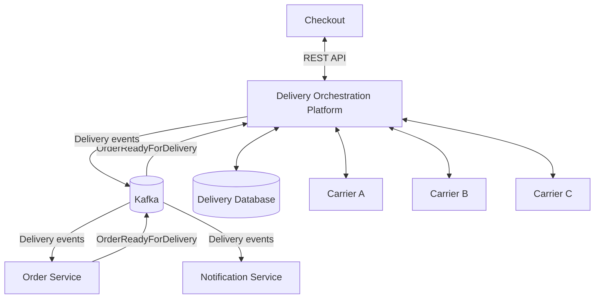

# Платформа оркестрации доставки маркетплейса

> Учебный System Design проект для портфолио системного аналитика.

**Статус:** архитектурное проектирование завершено.

## Быстрая навигация

| Раздел | Содержание |
|---|---|
| [Описание проекта](docs/01-project-brief.md) | Цель, scope, ограничения и основные сценарии |
| [Жизненный цикл Delivery](docs/02-delivery-lifecycle.md) | Статусы и переходы доставки |
| [Доменная модель](docs/03-domain-model.md) | Order, Shipment, DeliveryOffer, Delivery, DeliveryAttempt |
| [Модель данных](docs/04-data-model.md) | ERD и основные сущности БД |
| [API](docs/05-api.md) | REST API и контракты |
| [События](docs/06-events.md) | Kafka events и асинхронные взаимодействия |
| [Надёжность](docs/07-reliability.md) | Idempotency, retries, Outbox, DLQ, reconciliation |
| [NFR](docs/08-nfr.md) | Производительность, доступность, безопасность и мониторинг |
| [System Design](docs/09-system-design.md) | Архитектура и ключевые технические решения |
| [Диаграммы](#диаграммы) | C4, UML и BPMN |
| [OpenAPI](openapi/delivery-orchestration-api.yaml) | Формальная спецификация API |
| [Swagger UI](https://the-chill-ocean.github.io/delivery-orchestration-platform/swagger/) | Интерактивный просмотр API |

Проект посвящён проектированию платформы, которая объединяет несколько служб доставки и предоставляет внутренним системам маркетплейса единый интерфейс для расчёта, оформления и отслеживания доставки.

Результат проекта — комплект аналитической и архитектурной документации. Программная реализация не входит в текущий объём.

## 1. Бизнес-проблема

Маркетплейс работает с несколькими внешними перевозчиками, каждый из которых имеет собственные API, тарифы, ограничения и модель статусов.

Прямая интеграция каждой внутренней системы с перевозчиками приводит к дублированию интеграционной логики, усложняет подключение новых партнёров и увеличивает зависимость от особенностей внешних API.

Для решения этой проблемы проектируется Delivery Orchestration Platform.

Платформа предоставляет единый интерфейс для работы с доставкой и скрывает особенности интеграций с конкретными перевозчиками.

## 2. Основные возможности

В рамках проекта спроектированы:

- расчёт доступных вариантов доставки для каждого Shipment;
- расчёт стоимости и ожидаемых сроков;
- выбор курьерской доставки или ПВЗ;
- повторная проверка условий перед оплатой;
- асинхронное создание доставки;
- управление попытками оформления доставки у перевозчиков;
- переключение между перевозчиками;
- нормализация статусов доставки;
- отмена и возврат доставки;
- обработка сбоев внешних систем.

## 3. Границы системы

Delivery Orchestration Platform отвечает за расчёт предложений, оформление и сопровождение доставки.

Управление заказами, оплата, резервирование товаров и выбор склада остаются за другими системами маркетплейса.

Один Order может содержать несколько Shipment. Варианты доставки рассчитываются отдельно для каждого Shipment.

## 4. Высокоуровневая архитектура

Подробная архитектура и сценарии взаимодействия описаны в документе [System Design](docs/09-system-design.md).

## 5. Ключевые архитектурные решения

| Решение | Обоснование |
|---|---|
| Разделение Order и Shipment | Один заказ может содержать несколько физических отправлений |
| DeliveryOffer | Отдельная сущность для рассчитанных вариантов доставки |
| Delivery и DeliveryAttempt | Сохранение истории попыток оформления доставки у разных перевозчиков |
| Carrier Adapters | Изоляция внутренних контрактов от особенностей API перевозчиков |
| Kafka | Асинхронный запуск создания доставки и публикация событий |
| State Machine | Контроль допустимых переходов между состояниями доставки |
| Idempotency | Защита от повторного создания доставки и обработки дубликатов |
| Transactional Outbox | Согласованность изменений БД и публикации событий |
| Retry, DLQ и Reconciliation | Обработка технических ошибок и восстановление после сбоев |

## 6. Основной сценарий

1. Checkout передаёт параметры Shipment для расчёта доставки.
2. Платформа получает предложения от доступных перевозчиков и возвращает DeliveryOffer.
3. Пользователь выбирает вариант доставки.
4. Перед оплатой Checkout повторно проверяет выбранное предложение.
5. После готовности отправления Order Service публикует OrderReadyForDelivery.
6. Платформа создаёт Delivery и DeliveryAttempt.
7. Carrier принимает доставку.
8. Платформа отслеживает доставку, нормализует её статусы и публикует события.

Предусмотрены альтернативные сценарии: отказ перевозчика, изменение согласованных условий, отмена и возврат.

## 7. Документация

| Документ | Содержание |
|---|---|
| [01. Описание проекта](docs/01-project-brief.md) | Бизнес-контекст, цели, границы системы и основные сценарии |
| [02. Жизненный цикл доставки](docs/02-delivery-lifecycle.md) | Статусы, переходы, отмена и возвраты |
| [03. Доменная модель](docs/03-domain-model.md) | Сущности, ответственность и бизнес-связи |
| [04. Модель данных](docs/04-data-model.md) | Логическая модель данных и ERD |
| [05. REST API](docs/05-api.md) | Контракты расчёта, проверки, получения, отмены и возврата доставки |
| [06. События](docs/06-events.md) | Kafka, события и асинхронные взаимодействия |
| [07. Надёжность](docs/07-reliability.md) | Идемпотентность, Retry, DLQ, Outbox и обработка сбоев |
| [08. Нефункциональные требования](docs/08-nfr.md) | Производительность, доступность, безопасность и мониторинг |
| [09. System Design](docs/09-system-design.md) | Итоговая архитектура и основные проектные решения |
| [OpenAPI specification](openapi/delivery-orchestration-api.yaml) | Формальная спецификация REST API платформы в формате OpenAPI 3.0 |

## 8. Нефункциональные требования

Для проектирования сформирован предполагаемый нагрузочный профиль и определены целевые показатели производительности, доступности и восстановления после сбоев.

Все числовые значения являются учебными проектными допущениями. Они не подтверждены эксплуатационными измерениями и требуют проверки нагрузочным тестированием.

Подробности приведены в [нефункциональных требованиях](docs/08-nfr.md).

## 9. Ограничения проекта

Проект представляет собой архитектурную концепцию, а не действующую production-систему.

В текущем объёме не предусмотрены:

- разработка и развёртывание сервисов;
- реализация интеграций с реальными перевозчиками;
- проведение нагрузочного тестирования;
- подтверждение целевых SLO эксплуатационными измерениями.

## 10. Назначение проекта

Проект создан для практической проработки полного цикла системного анализа: от определения границ и бизнес-правил до проектирования моделей данных, API, интеграционных взаимодействий, механизмов надёжности и итоговой архитектуры.

Он демонстрирует подход к проектированию интеграционной платформы с несколькими внешними системами и асинхронными бизнес-процессами.

## 11. OpenAPI

REST API платформы формализован в OpenAPI 3.0.

- [Открыть Swagger UI](https://the-chill-ocean.github.io/delivery-orchestration-platform/swagger/)
- [OpenAPI YAML](openapi/delivery-orchestration-api.yaml)
- [Описание REST API](docs/05-api.md)

## 12. Диаграммы

Архитектура и ключевые сценарии платформы представлены на нескольких уровнях детализации.

| Диаграмма | Что показывает | Исходник |
|---|---|---|
| [C4 Level 1 — System Context](diagrams/c4/01-system-context.svg) | Границы системы и внешние взаимодействия | [PlantUML](diagrams/c4/01-system-context.puml) |
| [C4 Level 2 — Container](diagrams/c4/02-container-diagram.svg) | Внутреннюю структуру DOP | [PlantUML](diagrams/c4/02-container-diagram.puml) |
| [C4 Level 3 — Component](diagrams/c4/03-component-diagram.svg) | Компоненты Delivery Orchestration Service | [PlantUML](diagrams/c4/03-component-diagram.puml) |
| [BPMN — End-to-end delivery](diagrams/bpmn/01-delivery-process.svg) | Полный процесс доставки | [BPMN](diagrams/bpmn/01-delivery-process.bpmn) |
| [Sequence — создание Delivery](diagrams/uml/01-delivery-creation-sequence.svg) | `OrderReadyForDelivery` → создание Delivery → Carrier | [PlantUML](diagrams/uml/01-delivery-creation-sequence.puml) |
| [Sequence — переключение Carrier](diagrams/uml/02-carrier-switch-sequence.svg) | Отказ Carrier и согласование альтернативы | [PlantUML](diagrams/uml/02-carrier-switch-sequence.puml) |
| [Sequence — конкурентная отмена](diagrams/uml/03-cancellation-race-sequence.svg) | Race condition при отмене Delivery | [PlantUML](diagrams/uml/03-cancellation-race-sequence.puml) |
| [State Machine — Delivery](diagrams/uml/04-delivery-state-machine.svg) | Статусы и переходы Delivery | [PlantUML](diagrams/uml/04-delivery-state-machine.puml) |

## 13. Использование материалов

Проект создан в учебных и портфолио-целях.

© 2026 Рыбальченко Наталья. Все права защищены.

Материалы репозитория не предназначены для копирования, распространения,
модификации или использования в других проектах без разрешения автора.
