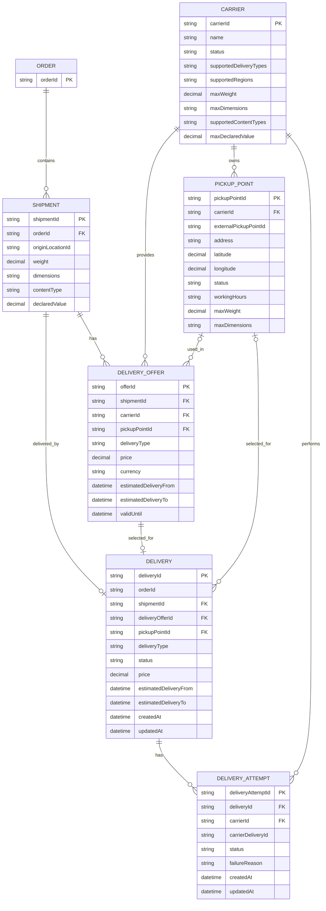

## 9. Логическая модель данных

Логическая модель отражает основные сущности Delivery Orchestration Platform и связи между ними.

`Order` является внешней сущностью. Владельцем заказа остаётся Order Service.

