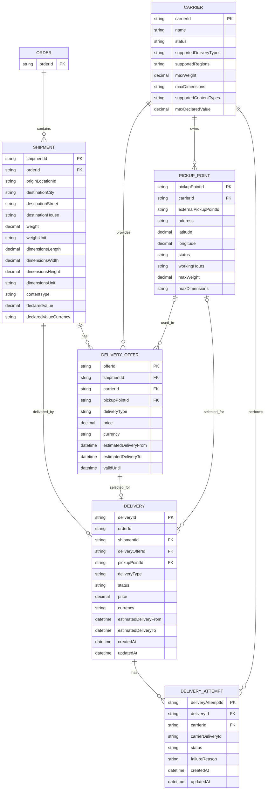

## 9. Логическая модель данных

Логическая модель отражает основные сущности Delivery Orchestration Platform и связи между ними.

`Order` является внешней сущностью. Владельцем заказа остаётся Order Service.

### Хранение параметров Shipment

Delivery Orchestration Platform хранит локальный snapshot параметров Shipment, полученных при расчёте DeliveryOffer.

Snapshot включает точку отправления, адрес назначения, физические характеристики и объявленную ценность.

Эти данные используются при последующем создании доставки без дополнительного запроса в Order Service.

### Единицы измерения и валюта

Платформа сохраняет физические характеристики Shipment
вместе с единицами измерения:

- `weight` и `weightUnit` — вес и единица измерения;
- `dimensionsLength`, `dimensionsWidth`, `dimensionsHeight`
  и `dimensionsUnit` — габариты;
- `declaredValue` и `declaredValueCurrency` —
  объявленная ценность и валюта.

При взаимодействии с Carrier Adapter выполняет преобразование
единиц измерения и валюты в соответствии с контрактом перевозчика.
Конвертация валюты требует отдельно определённых правил
и источника обменных курсов.

### 9.1. Основные связи

- `Order 1:N Shipment` — один заказ может быть разделён на несколько физических отправлений.
- `Shipment 1:N DeliveryOffer` — для одного отправления может быть рассчитано несколько вариантов доставки.
- `Shipment 1:0..1 Delivery` — фактическая доставка появляется после выбора и подтверждения варианта доставки.
- `DeliveryOffer 1:0..1 Delivery` — выбранное предложение может стать основой фактической доставки.
- `Delivery 1:N DeliveryAttempt` — для одной доставки может быть создано несколько попыток работы с перевозчиками.
- `Carrier 1:N DeliveryOffer` — один перевозчик может сформировать множество предложений доставки.
- `Carrier 1:N DeliveryAttempt` — один перевозчик может участвовать во множестве попыток доставки.
- `Carrier 1:N PickupPoint` — один перевозчик может иметь множество ПВЗ.
- `PickupPoint 1:N DeliveryOffer` — один ПВЗ может использоваться во множестве рассчитанных предложений.
- `PickupPoint 1:N Delivery` — через один ПВЗ может выполняться множество доставок.

### Связь Order и Delivery

Один Order может содержать несколько Shipment, каждый из которых
может иметь не более одной Delivery.

Таким образом, концептуальная связь между Order и Delivery — 1:N.
Она реализуется через Shipment.

Order является внешней сущностью, владельцем которой выступает
Order Service.

Поле `Delivery.orderId` хранит идентификатор заказа для поиска
и корреляции данных. Оно не является физическим внешним ключом
к таблице Order, поскольку Delivery Orchestration Platform
не владеет данными заказов.

Источником истины для Order остаётся Order Service.

### 9.2. Delivery и DeliveryAttempt

`Delivery` представляет бизнес-процесс доставки конкретного Shipment в целом.

`DeliveryAttempt` представляет отдельную попытку выполнить эту доставку через конкретного перевозчика.

Пример:

`Delivery #900`

- `DeliveryAttempt #1` — СДЭК, `FAILED`;
- `DeliveryAttempt #2` — DPD, `ACCEPTED`.

Такой подход позволяет:

- не перезаписывать историю при смене перевозчика;
- сохранять причины неуспешных попыток;
- анализировать успешность работы перевозчиков;
- хранить отдельный `carrierDeliveryId` для каждой попытки;
- проводить аудит и диагностику процесса оркестрации.

### 9.3. Статусы DeliveryAttempt

| Статус | Описание |
|---|---|
| `PENDING` | Попытка создана, ожидается результат взаимодействия с перевозчиком |
| `ACCEPTED` | Перевозчик подтвердил создание доставки |
| `FAILED` | Создать доставку через данного перевозчика не удалось |
| `CANCELLED` | Попытка была отменена до завершения |

Для неуспешной попытки дополнительно сохраняется `failureReason`.

Примеры причин:

- `CARRIER_UNAVAILABLE`;
- `UNSUPPORTED_DESTINATION`;
- `WEIGHT_LIMIT_EXCEEDED`;
- `TIMEOUT`;
- `INTERNAL_ERROR`.
