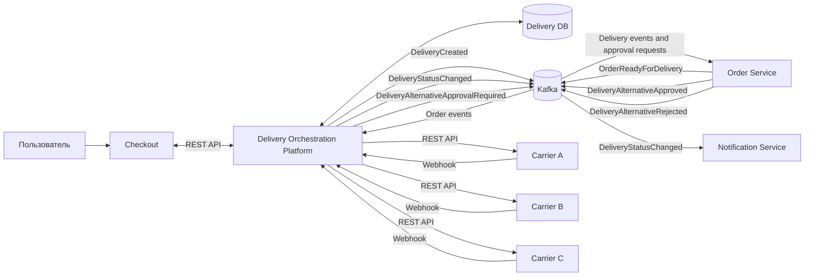
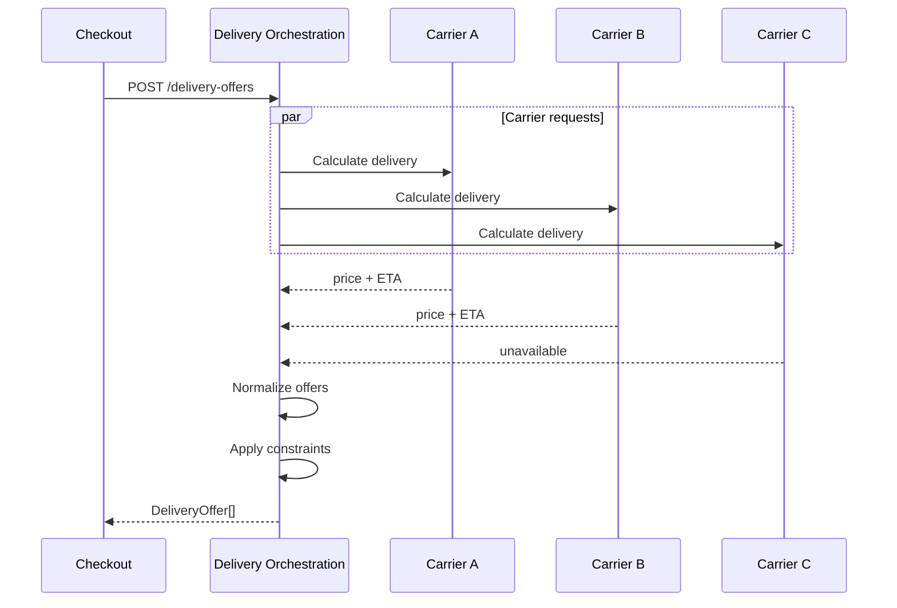

# Итоговый System Design

Документ описывает итоговую архитектуру Delivery Orchestration Platform.

Платформа отвечает за расчёт вариантов доставки, создание Delivery, взаимодействие с внешними Carrier, нормализацию статусов и публикацию событий о жизненном цикле доставки.

---

## 1. Границы системы

Delivery Orchestration Platform отвечает за:

- расчёт доступных вариантов доставки;
- получение стоимости и сроков от Carrier;
- нормализацию DeliveryOffer;
- повторную проверку выбранного DeliveryOffer;
- создание Delivery;
- создание и управление DeliveryAttempt;
- выбор и переключение Carrier;
- взаимодействие с внешними Carrier API;
- нормализацию статусов Carrier;
- жизненный цикл Delivery;
- отмену и возврат доставки;
- публикацию событий о состоянии Delivery.

Платформа не отвечает за:

- создание Order;
- оплату;
- резервирование товара;
- выбор склада;
- жизненный цикл Payment;
- управление складскими остатками.

---

## 2. Основные внешние системы

### Checkout

Использует Delivery Orchestration Platform для:

```text
расчёта DeliveryOffer;
выбора способа доставки;
повторной проверки выбранного DeliveryOffer.
```

### Order Service

Отвечает за жизненный цикл заказа.

После того как Shipment готов к доставке, публикует:

```text
OrderReadyForDelivery
```

### Carrier

Внешняя логистическая система.

Carrier предоставляет:

```text
расчёт тарифа;
ETA;
создание доставки;
отмену доставки;
статусы доставки;
webhook или API получения состояния.
```

Каждый Carrier может иметь собственные API и модель состояний.

---

## 3. Высокоуровневая архитектура



---

## 4. Основные компоненты Delivery Orchestration Platform

Логически платформу можно разделить на несколько компонентов.

### Delivery Offer Service

Отвечает за:

```text
POST /delivery-offers
POST /delivery-offers/{offerId}/validate
```

Функции:

- получение параметров Shipment;
- определение подходящих Carrier;
- вызов Carrier API;
- сравнение ограничений;
- расчёт стоимости;
- расчёт ETA;
- создание DeliveryOffer;
- контроль `validUntil`.

---

### Delivery Service

Отвечает за жизненный цикл Delivery.

Функции:

- создание Delivery;
- получение Delivery;
- изменение статуса;
- отмена;
- возврат;
- проверка допустимых state transitions.

---

### Carrier Orchestrator

Отвечает за выбор конкретного Carrier и управление DeliveryAttempt.

Функции:

- создание DeliveryAttempt;
- вызов Carrier API;
- переключение Carrier;
- retry;
- timeout;
- обработка ошибок Carrier.

---

### Carrier Adapters

Каждый Carrier может иметь отдельный adapter.

```text
CarrierAdapter
    |
    +-- CarrierAAdapter
    +-- CarrierBAdapter
    +-- CarrierCAdapter
```

Adapter преобразует внутреннюю модель платформы в контракт конкретного Carrier и обратно.

Например:

```text
Internal CreateDeliveryRequest
          ↓
Carrier Adapter
          ↓
Carrier-specific API request
```

То же самое используется для нормализации статусов.

---

### Status Normalizer

Преобразует внешний статус Carrier во внутреннюю модель Delivery.

Например:

```text
Carrier A: WITH_COURIER
Carrier B: LAST_MILE

        ↓

OUT_FOR_DELIVERY
```

Внутренние consumers не должны зависеть от статусов конкретного Carrier.

---

### Event Publisher

Отвечает за надёжную публикацию событий Delivery Orchestration Platform:

- `DeliveryCreated`;
- `DeliveryStatusChanged`;
- `DeliveryAlternativeApprovalRequired`.

Для надёжной публикации используется Transactional Outbox.

События `DeliveryAlternativeApproved` и `DeliveryAlternativeRejected` публикуются Order Service и обрабатываются Delivery Orchestration Platform.
---

## 5. Основной сценарий расчёта доставки



Платформа не возвращает Checkout Carrier-specific контракты.

Результат нормализуется в единую модель `DeliveryOffer`.

---

## 6. Проверка DeliveryOffer перед оплатой

Перед оплатой Checkout выполняет:

```text
POST /delivery-offers/{offerId}/validate
```

Возможные результаты:

```text
VALID
CHANGED
UNAVAILABLE
```

Если условия изменились, пользователь должен подтвердить новое предложение.

---

## 7. Создание Delivery

После того как Shipment готов к доставке:

```text
Order Service
      |
      | OrderReadyForDelivery
      v
Kafka
      |
      v
Delivery Orchestration
```

Платформа:

```text
1. проверяет событие на повторную обработку;
2. получает DeliveryOffer и snapshot Shipment;
3. создаёт Delivery и записывает DeliveryCreated
   в Transactional Outbox в рамках одной транзакции;
4. определяет Carrier;
5. создаёт DeliveryAttempt с выбранным carrierId;
6. вызывает Carrier API;
7. сохраняет carrierDeliveryId после подтверждения Carrier;
8. изменяет статус Delivery: CREATED → ACCEPTED.
```

---

## 8. Создание DeliveryAttempt

Одна Delivery может иметь несколько попыток выполнения.

Пример:

```text
Delivery dlv-1001

DeliveryAttempt #1
Carrier A
FAILED
TIMEOUT

DeliveryAttempt #2
Carrier B
ACCEPTED
```

Связь:

```text
Delivery 1:N DeliveryAttempt
```

Это позволяет сохранять историю попыток и не перезаписывать Carrier при переключении.

---

## 9. Переключение Carrier

Если первый Carrier не смог принять доставку:

```text
Carrier A
    ↓
FAILED
    ↓
проверка альтернатив
    ↓
Carrier B
```

Автоматическое переключение разрешается только если сохраняются условия, подтверждённые пользователем:

```text
deliveryType не меняется;
стоимость не увеличивается;
ETA остаётся допустимым;
Shipment удовлетворяет ограничениям нового Carrier.
```

Если условия меняются, требуется подтверждение пользователя.

Автоматическое переключение между разными Carrier допускается только для курьерской доставки (`COURIER`) при сохранении согласованных с пользователем условий.

Для доставки в ПВЗ (`PICKUP_POINT`) выбранный PickupPoint принадлежит конкретному Carrier. Поэтому смена перевозчика требует выбора нового варианта доставки и подтверждения пользователя.

Если для продолжения доставки потребовалось подтверждение новых условий, после получения `DeliveryAlternativeApproved` платформа обновляет согласованные параметры `Delivery`.

Новая попытка `DeliveryAttempt` создаётся только после подтверждения альтернативного предложения и выполнения необходимых платёжных операций.
---

## 10. Обработка статусов

Carrier может передавать статусы через webhook.

```text
Carrier
    |
    | external status
    v
Delivery Orchestration
    |
    | normalize
    v
Internal Delivery status
```

Перед изменением состояния проверяется state machine.

Например:

```text
IN_TRANSIT → OUT_FOR_DELIVERY
```

разрешено.

```text
DELIVERED → IN_TRANSIT
```

не разрешено.

---

## 11. Жизненный цикл Delivery

Основной courier flow:

```text
CREATED
    ↓
ACCEPTED
    ↓
PICKED_UP
    ↓
IN_TRANSIT
    ↓
OUT_FOR_DELIVERY
    ↓
DELIVERED
```

Для Pickup Point:

```text
CREATED
    ↓
ACCEPTED
    ↓
PICKED_UP
    ↓
IN_TRANSIT
    ↓
READY_FOR_PICKUP
    ↓
DELIVERED
```

Возврат:

```text
PICKED_UP / IN_TRANSIT / DELIVERY_FAILED
                    ↓
          RETURN_IN_PROGRESS
                    ↓
                RETURNED
```

---

## 12. Надёжность

Платформа проектируется с учётом:

```text
duplicate events;
timeout;
lost responses;
Carrier failures;
out-of-order events;
partial failures.
```

Используются:

```text
Idempotency
Retry
Exponential Backoff
DLQ
Circuit Breaker
Transactional Outbox
Reconciliation
```

---

## 13. Idempotency

Kafka используется с моделью:

```text
at-least-once
```

Поэтому события могут приходить повторно.

Используются два уровня защиты:

```text
eventId
```

для защиты от повторной обработки одного сообщения;

и:

```text
shipmentId
```

как бизнес-инвариант, предотвращающий создание нескольких активных Delivery для одного Shipment.

---

## 14. Transactional Outbox

Чтобы избежать ситуации:

```text
Delivery обновлена в БД
но
DeliveryStatusChanged не отправлен
```

используется Transactional Outbox.

```text
DB transaction

UPDATE Delivery

INSERT OutboxEvent

COMMIT
```

После commit отдельный publisher отправляет сообщение в Kafka.

---

## 15. Масштабирование

Приложение проектируется stateless.

```text
               Load Balancer
                    |
        +-----------+-----------+
        |           |           |
      DOP #1      DOP #2      DOP #3
        |           |           |
        +-----------+-----------+
                    |
              Delivery DB
                    |
                  Kafka
```

Горизонтальное масштабирование выполняется добавлением новых instances.

Kafka consumers масштабируются через consumer group.

---

## 16. Хранение данных

Основные сущности:

```text
Shipment
DeliveryOffer
Delivery
DeliveryAttempt
Carrier
PickupPoint
```

Order является внешней сущностью.

Delivery Orchestration хранит только ссылку:

```text
orderId
```

и не управляет жизненным циклом Order.

---

## 17. Ключевые архитектурные решения

### DeliveryOffer рассчитывается на Shipment

Один Order может содержать несколько Shipment из разных складов.

Поэтому варианты доставки рассчитываются отдельно для каждого Shipment.

---

### Carrier скрывается от Checkout для courier delivery

Пользователь выбирает условия доставки, а не конкретного Carrier.

Это позволяет платформе менять Carrier без изменения пользовательского сценария, если условия остаются прежними.

---

### Delivery и DeliveryAttempt разделены

`Delivery` представляет бизнес-процесс доставки Shipment.

`DeliveryAttempt` представляет конкретную попытку выполнить его через определённого Carrier.

---

### Статусы Carrier нормализуются

Внутренние сервисы работают только с единой моделью Delivery statuses.

Это снижает связанность с внешними Carrier.

---

### Создание Delivery асинхронное

Order Service публикует:

```text
OrderReadyForDelivery
```

и не ждёт выполнения внешнего Carrier API.

Это снижает связанность и позволяет буферизовать нагрузку через Kafka.

---

### Ошибка Carrier не равна ошибке всей платформы

Недоступность одного Carrier не должна останавливать работу с остальными.

---

## 18. Основные компромиссы

Асинхронная архитектура повышает отказоустойчивость и снижает связанность, но приводит к:

```text
eventual consistency;
необходимости idempotency;
дубликатам сообщений;
более сложному мониторингу;
необходимости DLQ и reconciliation.
```

Использование нескольких Carrier увеличивает доступность доставки, но требует:

```text
адаптеров;
нормализации контрактов;
нормализации статусов;
обработки разных SLA;
разных моделей ошибок.
```

---

## 19. Связанные документы

```text
docs/01-project-brief.md
docs/02-delivery-lifecycle.md
docs/03-domain-model.md
docs/04-data-model.md
docs/05-api.md
docs/06-events.md
docs/07-reliability.md
docs/08-nfr.md
```
